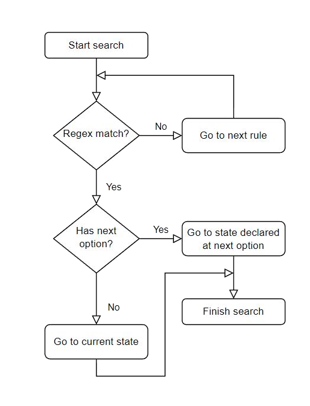

Tokenizer rules
===============

This chapter is intended for teachers who want to include at **VPL Tokenizer** new programming languages
or edit the existing ones. Teachers here will see how to create or edit tokenizer rules files and how to
add them to the **VPL module**.

Introduction
------------

**VPL Tokenizer** generates lexical analyzers by a list of rules stored in a JSON file.
These files are called *tokenizer rules files*, and provide teachers an interface to
define the way tokenizers would understand each token.

Tokenizer rules files are JSON files whose name must end as *tokenizer_rules.json*.
These special files could include C-style comments and are used not only to declare
the rules, but also to customize or configure the tokenizer.

.. code-block:: JSON

   {

      "name": "c-tokenizer",
      "extension": [ ".c", ".h" ],
      "check_rules": false,
      "states": {
         "start": [
            {
               "token": "comment.line",
               "regex": "\\/\\/"
            }
         ]
      }
   }

.. note::

   It is recommended to name the tokenizer rules files using the language's name.
   For example, for C language, the name would be "c_tokenizer_rules.json".

Structure
---------

Tokenizer rules files are declared using different options. These settings
customize the tokenizer's behaviour, its states and rules, and so on. Since
there is a great list of options, we have organized them according to their
accessibility (if could be used outside) and requirement (if it is optional).

- **General options:** settings associated with the programming language, tokens,
  the generated lexical analyzer, etc. These options are divided into three groups:

  - **Private options:** configuration would only affect to current tokenizer, and
    is not taken into account during the creation of other tokenizers.

  - **Inheritable options:** the configuration which would be used by another tokenizer by inheritance.
    This means that a tokenizer that inherits another one would include or update these options on itself.

  - **States option:** required option which contains a list of the states, each of them indexed by its name,
    which is used to generate a lexical analyzer. This attribute must always exist and could not be empty.

- **Rule options:** customization for each rule located at a state. These options define a token,
  or manipulate the current or next state to process.

To clarify the way options are declared, you just need to know that general and states options
are always declared at the first level of the JSON object. However, rule options would be always
a rule, which means that are inside a state that is located at the states option.

.. code-block:: JSON

   {
      "general_option_1": "value_1",
      "general_option_2": "value_2",
      "states": {
         "state_1": [
            {
               "rule_option_1": "value_3",
               "rule_option_2": "value_4",
            }
         ]
      }
   }

Behaviour
---------

This subsection gives information about the behavior of the VPL Tokenizer
during the creation of a lexical analyzer and its execution.

Preparation
^^^^^^^^^^^

During the generation of a lexical analyzer, VPL Tokenizer would
initialize each option following a list of instructions which
are shown here.

.. note::

   The order options declared in the tokenizer rules file do
   not affect the way tokenizer is initialized, so you have the
   freedom to decide where to put each available option.

1. Check JSON file discarding all the comments
2. Init check_rules to discard possible future checks
3. Init inherit_rules for future inheritance operation
4. Set tokens with override_tokens, inheritance is considered
5. Prepare the rest of options except states
6. Init states option considering inheritance

Parse
^^^^^

VPL Tokenizer uses a top-bottom method during the search for a token.
This means that the tokenizer starts at a state, and will continue to the
closest rule which is below the current one until the search finishes. When
token was found, the next state to search would be the current one or the one
declared at "next".

.. note::

   The previous explanation does not consider advanced cases such as
   use "default_token" option, or "next" without "token" and "regex".

Options
-------

This subsection shows information for each option supported by VPL Tokenizer.
For each option type, a table with the features, as indicated in the next table,
is shown, as well as an explanation for each option.

.. csv-table::
   :header: "Name", "Required", "Inheritable", "Type"

   "Option's Name", "Yes/No", "Yes/No", "Data Type"

General options
^^^^^^^^^^^^^^^

.. csv-table::
   :header: "Name", "Required", "Inheritable", "Type"

   "name", "No", "No", "String"
   "extension", "No", "No", "String or Array of Strings"
   "check_rules", "No", "No", "Boolean"
   "inherit_rules", "No", "No", "String"
   "override_tokens", "No", "Yes", "Object of Strings"
   "max_token_count", "No", "No", "Natural"
   "states", "Yes", "Yes", "Object of States"

**name**

   The tokenizer's name is used at some error messages to clarify
   what tokenizer has failed. The default value of this option
   is ``'default'``.

   .. note::

      It is recommended to specify the tokenizers' name using the format
      ``<name_language>-tokenizer`` where ``name_language`` is the
      human-readable programming language name.

**extension**

   The list of extensions of the programming language that is
   being tokenized. Each extension must always start with a dot
   character. For example::

      {
         "extension": [ ".c", ".h" ]
      }

   By default, extensions are ignored, so it is not necessary to
   declare this option if you want to allow any kind of file.
   However, you can put its default value, which is ``'no-ext'``.
   For example::

      {
         "extension": "no-ext"
      }

**check_rules**

   If true, options and rules would be checked before tokenizing.
   It is recommended to set this option to false to improve the
   performance of the tokenizer. The default value is ``'true'``.

**inherit_rules**

   The relative path of another tokenizer rules file which will be
   inherited at the current one. Take into account that ``.json`` must
   not be included. For example::

      {
         "inherit_rules": "rules/c_tokenizer_rules"
      }

   By default, the inheritance would consider new states and rules,
   as well as repeated states which have new rules. Besides, some
   options such as ``override_tokens``, would be inherited
   following the same restrictions explained before.

**override_tokens**

   The list of types for new or existed tokens which will be used
   during the tokenization. It is possible to use raw VPL types,
   or referencies of other token's name. For example::

      {
         "override_tokens": {
            "keyword.control.c": "keyword.control",
            "reserved.c": "vpl_reserved"
         }
      }

   If you want to ignore some tokens, you can use ``vpl_null``
   or a blank value. For example::

      {
         "override_tokens": {
            "comment.c": "vpl_null",
            "comment": ""
         }
      }

   To see the full list of existed tokens' names, click
   `here <https://github.com/losedavidpb/moodle-mod_vpl/blob/v3.5.0%2B%2B/classes/tokenizer/tokenizer.php>`_.

   .. note::

      Raw VPL types must always be named using the prefix ``vpl_``.

**max_token_count**

   The maximum number of tokens allowed at tokenization. When this number is
   reached, next tokens' types would be ``'overflow'``. Default value is ``2000``.

**states**

   The list of states that contains all the rules. Each state must be indexed
   with its unique name, like it is shown at this example::

      {
         "states": {
            "start": [
               {
                  "token": "comment.line",
                  "regex": "\\/\\/$",
                  "next": "start"
               },
               {
                  "token": "comment",
                  "regex": "\\/\\/",
                  "next": "singleLineComment"
               },
            ],
            "singleLineComment": [
               {
                  "token": "comment.line",
                  "regex": "\\$",
                  "next": "singleLineComment"
               },
               {
                  "token": "comment.line",
                  "regex": "$",
                  "next": "start"
               },
               {
                  "default_token": "comment.line"
               }
            ]
         }
      }

   .. note::

      All tokenizer rules file must always have a special state named as ``start``.
      This state will be processed first, so search starts here.

Rule options
^^^^^^^^^^^^

.. csv-table::
   :header: "Name", "Required", "Inheritable", "Type"

   "token", "Yes if next or default_token not found", "No", "String or Array of Strings"
   "regex", "Yes if next or default_token not found", "No", "String"
   "default_token", "No", "No", "String"
   "next", "No", "No", "String"

**token**

   The token's name of a rule. This option must be one of the available tokens' names.
   To see the complete list of names, go
   `here <https://github.com/losedavidpb/moodle-mod_vpl/blob/v3.5.0%2B%2B/classes/tokenizer/tokenizer.php>`_.

   .. note::

      Special tokens such as ``default_token`` could not be declared next to the ``token``,
      but is necessary to include ``regex`` if the ``token`` is defined.

**regex**

   The regular expression to match. For development reasons, ``/`` character must be
   escaped using ``\\``, so, for example, ``//`` regex would be written as ``\\/\\/``.

   It is possible to define matching groups using ``(`` and ``)``. In that case, there must
   be as many tokens as groups declared. For example::

      {
         "states": {
            "start": [
               {
                  "token": [ "keyword.storage", "text", "identifier" ],
                  "regex": "(int|float|long|double)(\\s+)(.+)"
               }
            ]
         }
      }

**default_token**

   The token's name for the next state. ``default_token`` is used to consider cases
   in which any rules has not match but it is known the type of the token. For
   example::

      {
         "states": {
            "start": [
               {
                  "token": "comment.line",
                  "regex": "\\/\\/$",
                  "next": "start"
               },
               {
                  "token": "comment.block",
                  "regex": "\\/\\*(\\*?)",
                  "next": "multipleLineComment"
               }
            ],
            "multipleLineComment": [
               {
                  "token": "comment.block",
                  "regex": "\\*\\/",
                  "next": "start"
               },
               {
                  "default_token": "comment.block"
               }
            ]
         }
      }

   .. note::

      This option must be always declared alone.

**next**

   The next state to search for next token. This option would be used whether
   regex matches or the current rule has only defined ``next``.

Example of use
--------------

This subsection shows an example of a tokenizer rules file with
some of the options explained.

.. code-block:: JSON

   {
      "name": "ada-tokenizer",
      "extension": [ ".adb", ".ads", ".ada" ],
      "check_rules": false,
      "inherit_rules": "text_tokenizer_rules",
      "states": {
         "start": [
            {
               "token": "comment",
               "regex": "--.*$"
            },
            {
               "token": "string.double",
               "regex": "\".*?\""
            },
            {
               "token": "string.single",
               "regex": "'.'"
            },
            {
               "token": "constant.numeric",
               "regex": "[+-]?[0-9]+((\\.[0-9]*)?([eE][+-]?[0-9]+)?)?\\b"
            },
            {
               "token": "support.function",
               "regex": "count|min|max|avg|sum|rank|now|coalesce|main"
            },
            {
               "token": "keyword",
               "regex": "abort|else|new|return|abs|elsif|not|reverse|abstract|end|null|accept|entry|select|access"
            },
            {
               "token": "keyword",
               "regex": "exception|of|separate|aliased|exit|or|some|all|others|subtype|and|for|out|synchronized|array|function"

            },
            {
               "token": "keyword",
               "regex": "overriding|at|tagged|generic|package|task|begin|goto|pragma|terminate|body|private|then|if|procedure|type"
            },
            {
               "token": "keyword",
               "regex": "case|in|protected|constant|interface|until|is|raise|use|declare|range|delay|limited|record|when|delta|loop"
            },
            {
               "token": "keyword",
               "regex": "rem|while|digits|renames|with|do|mod|requeue|xor"
            },
            {
               "token": "constant.language",
               "regex": "true|false|null"
            },
            {
               "token": "identifier",
               "regex": "[a-zA-Z_$][a-zA-Z0-9_$]*"
            },
            {
               "token": "keyword.operator",
               "regex": "\\+|\\-|\\/|\\/\\/|%|<@>|@>|<@|&|\\^|~|<|>|<=|=>|==|!=|<>|="
            },
            {
               "token": "paren.lparen",
               "regex": "[\\(]"
            },
            {
               "token": "paren.rparen",
               "regex": "[\\)]"
            },
            {
               "token": "text",
               "regex": "\\s+"
            }
         ]
      }
   }

Contribute
----------

If you want to include new programming languages, or contribute
to existing ones, please contact to Juan Carlos Rodriguez-del-Pino
by the email jc.rodriguezdelpino@ulpgc.es, or to David Parreño Barbuzano
using the email losedavidpb@gmail.com
