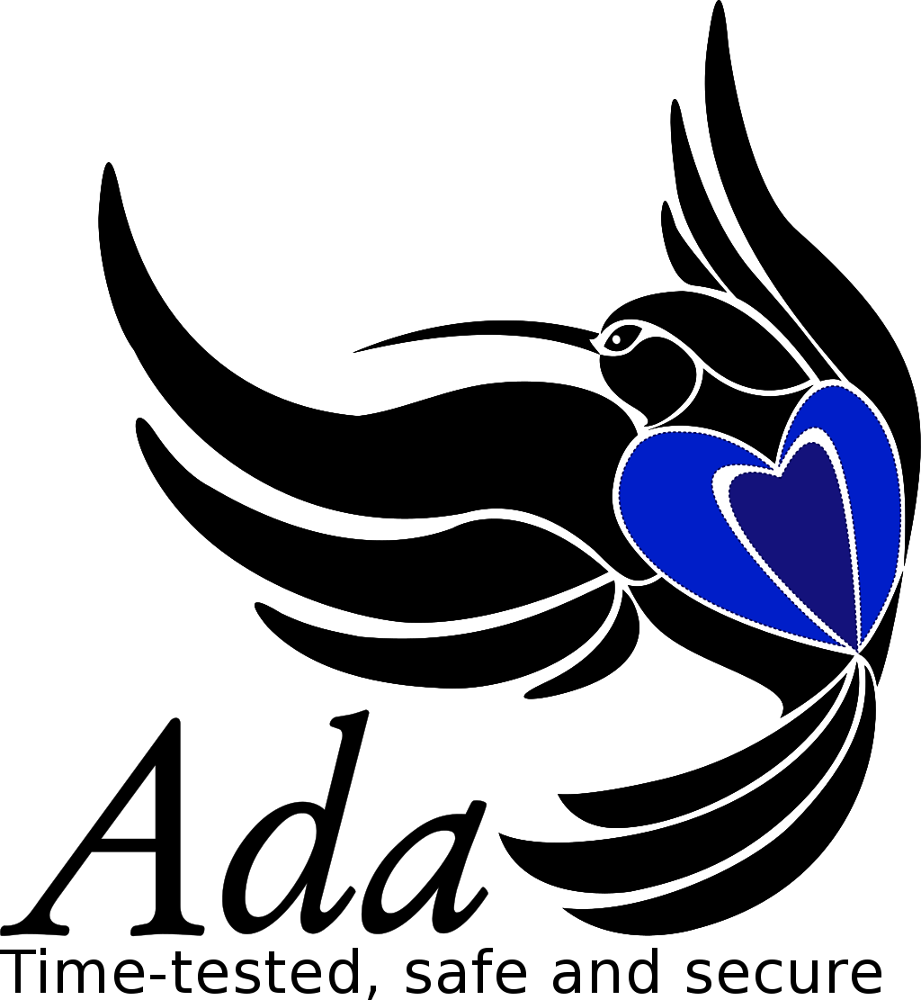
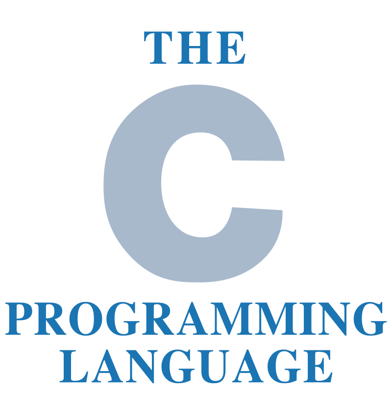
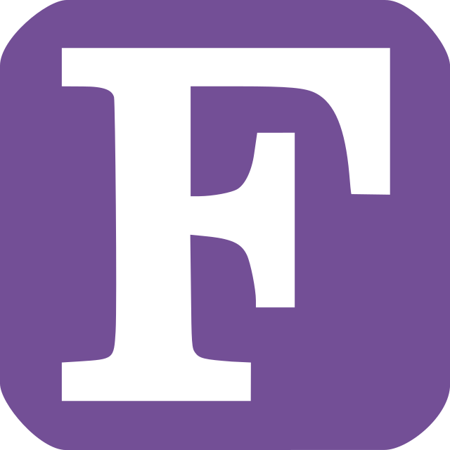
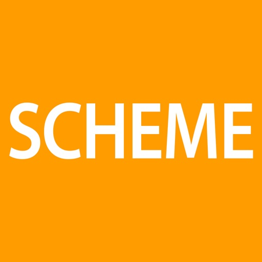

3. Languages supported
======================

This chapter shows a complete list of supported programming languages. For each
one, a table with information about support as indicated in the next table is shown.

.. csv-table::
   :header: "Feature", "Supported", "Details"
   :align: center

   "Name", "Name of the Tokenizer", "The name to detect the tokenizer."
   "File extensions", "List of extensions", "The system uses it to detect what programming language to use."
   "Compiler/Interpreter", "Tool used", "External links"
   "Old Similarity", "Yes/No", "If the search by similarity at old tokenizer is supported"
   "Other", "", "Other supported features"

.. note::

   If you don't find the programming language that you are searching for, contact us
   by the mail jc.rodriguezdelpino@ulpgc.es or losedavidpb@gmail.com.

3.1. Ada
--------

Ada is a structured, statically typed, imperative, and object-oriented programming language.
Home page https://www.adaic.org

.. csv-table::
   :header: "Feature", "Supported", "Details"
   :align: center

   "Name", "ada-tokenizer", ""
   "File extensions", "ada, adb, ads", ""
   "Compiler/Interpreter", "Gnat", "GNAT (GNU Ada) http://www.gnu.org/software/gnat/"
   "Old Similarity", "Yes", ""
   "Other", "Versions", "Available versions for Ada 2005 and Ada 2012. Ada 2005 is the default compiler."

3.2. C
------

C is a general-purpose, imperative programming language that supports structured programming.

.. csv-table::
   :header: "Feature", "Supported", "Details"
   :align: center

   "Name", "c-tokenizer", ""
   "File extensions", "c, h", ""
   "Compiler/Interpreter", "gcc", "GNU GCC https://gcc.gnu.org/"
   "Old Similarity", "Yes", ""
   "Other", "Versions", "Available ANSI-C, C99 and C11. Default version is the compiler default version."

3.3. C++
--------

.. image:: _static/languages/cpp.png
   :width: 100
   :height: 100
   :align: left

C++ is a moderm general-purpose programming language derived from C.

.. csv-table::
   :header: "Feature", "Supported", "Details"
   :align: center

   "Name", "cpp-tokenizer", ""
   "File extensions", "cc, cpp, C, c++, hxx, H", ""
   "Compiler/Interpreter", "g++", "GNU C++ https://gcc.gnu.org/projects/cxx-status.html"
   "Old Similarity", "Yes", ""
   "Other", "Versions", "Versions available C++98, C++11, C++14, C++17. Default version is the compiler default version."

3.4. Fortran
------------

Fortran (formerly FORTRAN) is a general-purpose, compiled imperative programming language.

.. csv-table::
   :header: "Feature", "Supported", "Details"
   :align: center

   "Name", "fortran-tokenizer", ""
   "File extensions", "f, F", ""
   "Compiler/Interpreter", "gfortran", "GNU GCC Fortran https://gcc.gnu.org/fortran/"
   "Old Similarity", "Yes", ""
   "Other", "", ""

3.5. Java
---------

.. image:: _static/languages/java.png
   :width: 100
   :height: 150
   :align: left

Java is a moderm object-oriented programming language.
Home page https://www.oracle.com/java/.

.. csv-table::
   :header: "Feature", "Supported", "Details"
   :align: center

   "Name", "java-tokenizer", ""
   "File extensions", "java", ""
   "Compiler/Interpreter", "javac and java", "https://www.oracle.com/java/ and https://openjdk.java.net/"
   "Old Similarity", "Yes", ""
   "Other", "", ""

3.6. Scheme
-----------

Scheme is a functional programming language derived from Lisp.

.. csv-table::
   :header: "Feature", "Supported", "Details"
   :align: center

   "Name", "scheme-tokenizer", ""
   "File extensions", "scm, ss", ""
   "Compiler/Interpreter", "mzscheme", "https://racket-lang.org/"
   "Old Similarity", "Yes", ""
   "Other", "", ""
